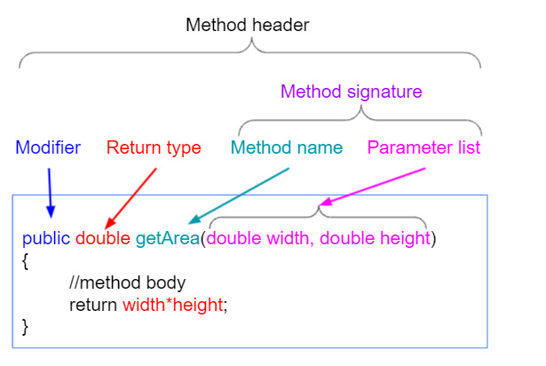

## Methods

## Keyword
| [Defining Methods](#1-defining-methods) | [Access Modifiers](#2-access-modifiers) | [Varargs Parameters](#3-varargs-parameter) | </br>
| [Method Overloading](#4-method-overloading) |
## 1. Defining Methods


- *return type:* primitive or object
- method name is Java identifier (same rules as variable names)
- parameters in parameter list are separated by comma
- after throws there can be more than one exception, separated by comma
- method must have a body { }, even if it is empty 
```java
    public void doNothing() {} // OK
```

## 2. Access Modifiers
|                       |                                                                                                     |
|-----------------------|-----------------------------------------------------------------------------------------------------|
| `private`             | Method or field can be accessed only within the class in which they are declared                    |
| `default`(no keyword) | Method or field can be accessed only within the same package                                        |
| `protected`           | Method or filed can be accessed within the same package and outside the package through child class |
| `public`              | Method of field can be accessed from everywhere in the program                                      |

## 3. Varargs Parameter
- Method can accept any number of parameters of the same type
- Two rules to keep in mind:
  1. a method can have at most one varargs argument
  2. varargs argument must be the last parameter in the parameter list

```java
public class App{
    public static void main(String[] args) {
        greet("Hello", "John", "George", "Luke");

        // you can pass an array as varargs
        String[] allNames = {"Peter", "Paul"};
        greet("Hello", allNames);
    }

    public void greet (String greeting, String... names) {
        for (String name : names) {
            System.out.println(greeting + ", " + name + "!");
        }
    }
}
```
------------------
## 4. Method Overloading
Method Overloading means defining multiple methods with the same name in the same class, but with different parameters (type, number, or order).
Example:
```java
public class Calculator {
    // Overloaded methods
    public int add(int a, int b) {
        return a + b;
    }

    public double add(double a, double b) {
        return a + b;
    }

    public int add(int a, int b, int c) {
        return a + b + c;
    }
}
```
----------
### 🔸 Rules of Method Overloading
| Rule                                     | Example                                                       |
|------------------------------------------|---------------------------------------------------------------|
| ✅ Different number of parameters         | `add(int a)` vs `add(int a, int b)`                           |
| ✅ Different types of parameters          | `add(int a, int b)` vs `add(double a, double b)`              |
| ✅ Different order of parameters (types)  | `sum(int a, String b)` vs `sum(String a, int b)`              |

